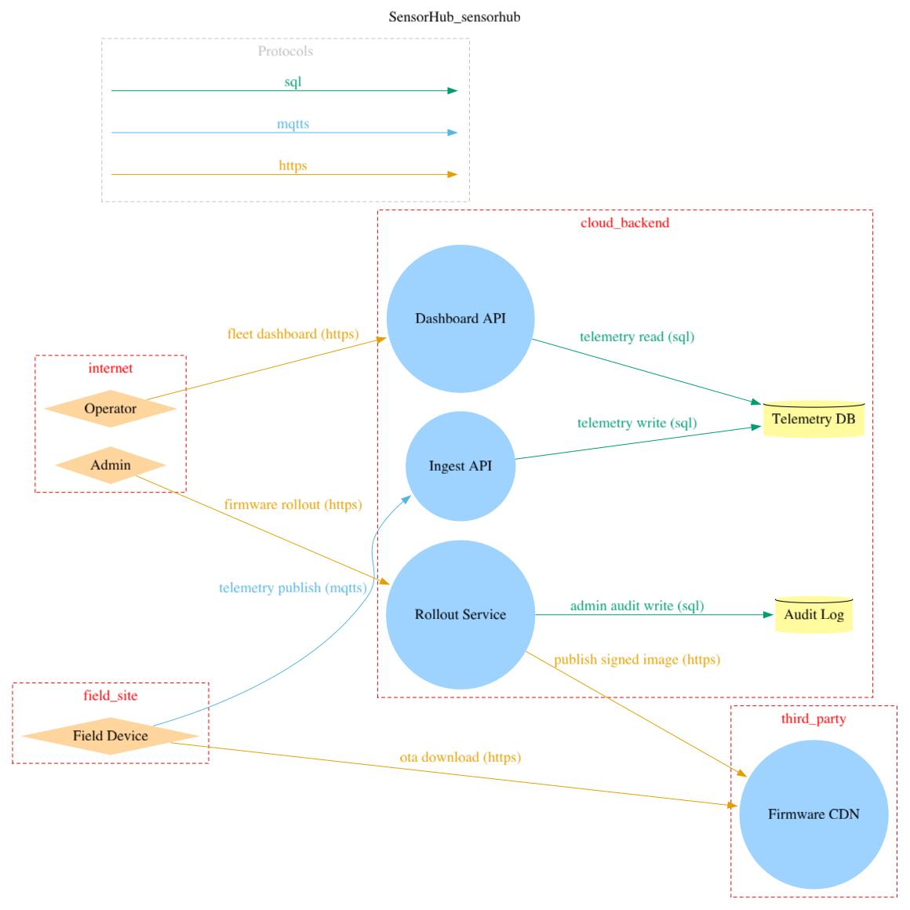

# ENISA Secure by Design - a worked example

ENISA's newly published, [Secure by Design and Default Playbook][enisa], opens with trust
boundaries and threat modelling. Not least privilege, not authentication. Threat modelling is playbook number **01**. It ends with a release gate written as a
six-item checklist, and a "minimum evidence" list of what you should be able to
produce on demand.

If you tease out the evidence they're looking for, it stops looking like documentation:

> - One architecture/data-flow diagram with trust boundaries and entry points (stored in repo/wiki)
> - Top threats list (e.g. the top 5 to 10 threat scenarios) with H/M/L priority and owners
> - Control/default mapping for each top threat (what control, where enforced, how verified)
> - Verification evidence: CI outputs or test results for key negative tests (unauthorised calls fail)

What this sounds like is a schema. This repository implements it.

**SensorHub** is a fictional SME fleet-telemetry product. Devices report over
MQTT/TLS to a cloud ingest API, operators watch fleets on a dashboard, admins
push firmware over the air. It is shaped to hit the exact trust boundaries
ENISA names: device–cloud, internet–back end, tenant–tenant, user–admin.

The entire threat model is [one HCL file](threatmodel/sensorhub.tm.hcl). The
diagram below is generated from it. The release gate is
[executable policy](policy/enisa-release-gate.hcl) that fails the build.



---

## The release gate, item by item

Playbook 01's release gate, quoted verbatim, against what produces it here.

| ENISA Playbook 01 release gate | Artifact here | Produced by |
| --- | --- | --- |
| Diagram updated for this release (components, flows, dependencies reflect reality) | [`dist/sensorhub-dfd.png`](dist/sensorhub-dfd.png) | Generated from the model. CI regenerates it and **fails if the committed copy is stale**, so the picture cannot drift from the model it claims to describe. |
| Trust boundaries and privileged paths clearly marked | `trust_zone` blocks in the DFD; every flow carries an explicit `protocol` | Model source. Three invariants fail the build if any element sits outside a zone, one more if a flow's protocol is unstated. |
| Top threat scenarios reviewed; high risks have mitigations or documented exceptions | Six `threat` blocks, each with a `risk` block and a control | `high_risks_are_mitigated`. A high or critical threat with no implemented control exits non-zero. |
| Secure defaults confirmed for new/exposed interfaces (deny by default, least privilege) | `control` blocks, each with an `owner` and `verification` attribute | `controls_have_owners` and `controls_map_to_verification`. |
| Verification in place: at least one negative test per critical boundary / privileged path | `negative_test` attribute on each control | `critical_paths_have_negative_tests`. The tests themselves live with the code they test; this repo holds the mapping. |
| Threat model refresh triggered if any of the following are relevant: new API/interface, auth model change, new sensitive data, major dependency/supplier change, OTA/update changes, major architecture change | The model lives in the repo, so every trigger is visible in a diff | [The workflow](.github/workflows/threat-model.yml) runs on any PR touching the model. See [Gate item 6](#gate-item-6-refresh-triggers) for the harder direction. |

Eleven invariants, one per checkbox plus the sub-checks each one implies.

## Run it

Requires [threatcl][cli] and graphviz.

```
make validate   # does the model still parse against the spec?
make gate       # does it pass ENISA Playbook 01's release gate?
make dfd        # regenerate the diagram after changing the model
make check      # everything CI runs
```

A passing gate is quiet:

```
$ make gate
Validated 1 threatmodels in 1 files
Checked 11 invariants against 1 threatmodels: 0 errors, 0 warnings, 0 exemptions
```

## Watch it fail

A checklist you tick by hand is a checklist you tick by hand. The point of
writing the gate as policy is that it is *hostile*. It fails on the omissions
that a human reviewer waves through at 5pm on a Friday.

Delete the `negative_test` attribute from the RBAC control, which is exactly
the kind of thing that disappears in a rushed refactor, and:

```
$ threatcl validate -invariants=policy/enisa-release-gate.hcl threatmodel/sensorhub.tm.hcl
Validated 1 threatmodels in 1 files
Invariant violation [error] 'critical_paths_have_negative_tests': threat
'operator_escalates_to_admin' in threatmodel 'SensorHub'
(threatmodel/sensorhub.tm.hcl): threat 'operator_escalates_to_admin' is high
but names no negative_test — ENISA requires at least one negative test per
critical boundary

Checked 11 invariants against 1 threatmodels: 1 errors, 0 warnings, 0 exemptions
$ echo $?
1
```

Non-zero exit, so the pull request goes red. The same happens if you drop a
risk rating, leave a service outside a trust zone, forget a control owner, or
mark a mitigation on a high-severity threat as unimplemented.

Genuine exceptions are not forbidden. ENISA allows "documented exceptions", 
but they have to be written into the policy file as an `exemption` block with a
justification, where a reviewer can see them. The waiver becomes a diff.

## Prioritisation - the documented method

ENISA asks for H/M/L priority "using a documented method appropriate to the
product, such as assessing impact, likelihood, plausibility, exploitability and
exposure". Prose in a wiki is not a method. Here it is a `risk` block:

```hcl
risk {
  likelihood = "medium"
  impact     = "high"
  rationale  = "Operator accounts are numerous and comparatively easy to
                obtain via phishing. Reaching rollout endpoints lets an
                attacker push firmware to customer fleets."
}
```

`likelihood` and `impact` are ordinal enums (`very_low` … `very_high`).
threatcl resolves the pair through a severity matrix, so the H/M/L band is
computed the same way for every threat rather than argued case by case. The
`rationale` is where exploitability, exposure and plausibility get recorded;
it is required reading in review, and it is versioned alongside the rating it
justifies.

For SensorHub that yields:

| Threat | Likelihood | Impact | Severity | Owner |
| --- | --- | --- | --- | --- |
| Spoofed device publishes fabricated telemetry | medium | high | **high** | platform |
| Malicious firmware via compromised CDN | low | very_high | **high** | firmware |
| Operator escalates to admin rollout functions | medium | high | **high** | app |
| Cross-tenant telemetry read | medium | high | **high** | app |
| Device credential extraction from flash | medium | medium | medium | firmware |
| Replay of stale device commands | low | medium | low | firmware |

Six threats, inside the 5-to-10 band ENISA asks for, which is itself checked
by a warning-severity invariant.

Because the ratings are structured, "show me every unmitigated high across all
our products" is a query rather than a reading exercise.

## Minimum evidence

| ENISA minimum evidence | Where it is |
| --- | --- |
| One architecture/data-flow diagram with trust boundaries and entry points, stored in repo | [`dist/sensorhub-dfd.png`](dist/sensorhub-dfd.png), generated from [`data_flow_diagram_v2`](threatmodel/sensorhub.tm.hcl) |
| Top threats list with H/M/L priority and owners | Six `threat` blocks with `risk` blocks; owners as control attributes |
| Control/default mapping for each top threat — what, where enforced, how verified | `control` blocks: `description` says what and where, `verification` says how |
| Verification evidence: CI outputs for key negative tests | [The workflow](.github/workflows/threat-model.yml) publishes the diagram as a build artifact; `negative_test` names the test per critical boundary |

## Gate item 6: refresh triggers

The last checkbox is the one that quietly decays. ENISA wants the model
refreshed on a new interface, an auth change, new sensitive data, a major
dependency change, an OTA change, or an architecture change.

Every one of those is visible in a diff. Two directions, two mechanisms:

- **Model changed, gate not re-run.** Handled here. The workflow triggers on
  any pull request touching `threatmodel/` or `policy/`, so the gate re-runs
  before the change can merge.
- **Code changed, model did not.** The harder and more common direction — the
  new endpoint ships and nobody opens the `.tm.hcl`. That comparison is what
  [`/threat-drift`][plugin] does: it reads recent code changes and reports what
  the documented model no longer covers.

Neither is a substitute for judgement. Both remove the excuse that nobody
noticed.

## What is here

```
.
├─ threatmodel/
│  └─ sensorhub.tm.hcl          # the model - one file, the source of everything else
├─ policy/
│  └─ enisa-release-gate.hcl    # ENISA Playbook 01's release gate as executable policy
├─ .github/workflows/
│  └─ threat-model.yml          # validate → gate → staleness check → publish evidence
├─ dist/
│  ├─ sensorhub-dfd.png         # generated diagram (rendered above)
│  └─ sensorhub-dfd.dot         # deterministic source, used for the staleness check
└─ Makefile
```

Use this as a starting point via **Use this template**, or copy the two files
that matter, the model and the policy, into a repo you already have.

Worth knowing if you adapt it:

- The workflow installs a **pinned** threatcl version and verifies its
  checksum, rather than pulling `latest`. A release gate whose meaning can
  change underneath you is not a gate. (ENISA playbook 14 is supply chain
  controls; it would be a poor look to skip it here.)
- The staleness check compares generated **DOT**, not PNG bytes, because PNG
  output shifts with the graphviz version and would produce false failures.
- The gate runs the CLI directly rather than via [`threatcl-action`][action],
  which does not currently expose the `-invariants` flag.

## Links

- [ENISA Secure by Design and Default Playbook][enisa] - the source. Playbook 01 is [`01-trust-boundaries-and-threat-modelling.md`](https://github.com/enisaeu/enisa-sbd-playbook/blob/main/playbooks/01-trust-boundaries-and-threat-modelling.md)
- [threatcl][cli] - the CLI. Threat modelling as HCL, in your repo
- [threatcl spec][spec] - the schema these files are written against
- [threatcl Claude plugin][plugin] - `/threat-drift`, `/threat-for-code`
- [Threatcl Cloud][cloud] - the org layer: models across repos, a shared control library, and threat model status workflow

Under the [CRA][cra], reporting obligations begin **11 September 2026**, with
the full essential requirements following in December 2027. Annex C of the
ENISA playbook maps each of its principles to CRA Annex I. Whatever tooling you
choose, the evidence it asks for is easier to produce continuously than to
reconstruct in an audit.

[enisa]: https://github.com/enisaeu/enisa-sbd-playbook
[cli]: https://github.com/threatcl/threatcl
[spec]: https://github.com/threatcl/spec
[action]: https://github.com/threatcl/threatcl-action
[plugin]: https://github.com/threatcl/claude-plugin
[cloud]: https://threatcl.com/?utm_source=github&utm_medium=readme&utm_campaign=enisa-sbd
[cra]: https://digital-strategy.ec.europa.eu/en/policies/cyber-resilience-act
